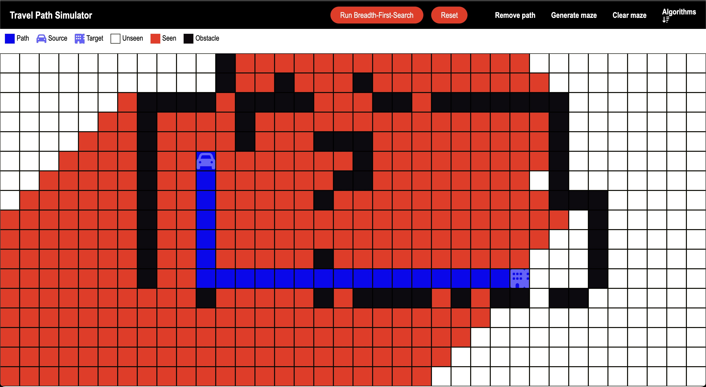
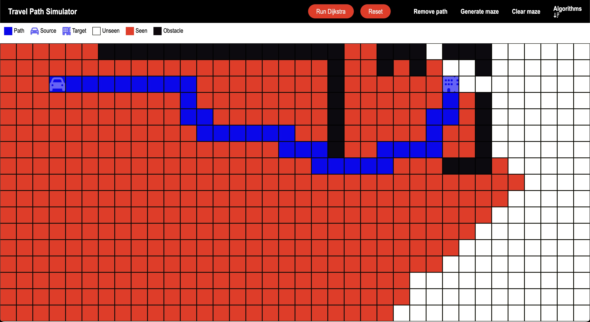

# Travel-Path-Simulator
An engaging web application that demonstrates the workings of various pathfinding algorithms in real time. Users can design custom mazes, set start and end points, and observe how different algorithms navigate through the grid to find the optimal path.

## 🌟 Features

- **Multiple Pathfinding Algorithms:**
  - Breadth-First Search (BFS)

  - Dijkstra's Algorithm 

- **Interactive Grid:**
  - Drag and drop start/end points
  - Click and drag to create walls/obstacles
  - Dynamic grid sizing based on viewport
  - Clear path and board options

- **Maze Generation:**
  - Automated maze generation using recursive division
  - Animated wall creation

- **Real-time Visualization:**
  - Color-coded cell states
  - Animated path discovery
  - Visualized visited nodes

## 🎮 How to Use

1. **Select Algorithm:**
   - Click the "Algorithms" dropdown
   - Choose between DFS, BFS, or Dijkstra's algorithm

2. **Create Maze:**
   - Click and drag to draw walls
   - Use "Generate maze" for automatic maze creation
   - Use "Clear maze" to remove all walls

3. **Set Points:**
   - Drag the source (start) and target (end) points to desired locations

4. **Visualize:**
   - Click "Start" to begin the visualization
   - Use "Remove path" to clear the current path while keeping walls
   - Use "Reset" to return to initial state

## 🎨 Visual Guide

- 🟦 Path: Final route from start to end
- 🟢 Source: Starting point
- 🔴 Target: Destination point
- ⬜ Unseen: Unvisited cells
- 🟨 Seen: Visited cells during algorithm execution
- ⬛ Obstacle: Walls/barriers

## 🛠️ Technical Implementation

### Core Components

- **Grid System:**
  - Dynamically sized grid using CSS Grid
  - Responsive design with viewport adjustments
  - Cell-based interaction system

- **Algorithm Implementation:**
  - Modular algorithm design
  - Priority Queue implementation for Dijkstra's
  - Path reconstruction using parent mapping

- **Animation System:**
  - Custom CSS animations for:
    - Path discovery
    - Wall creation
    - Node visiting
    
